# 基于Windows平台的高性能部署方式

在新版本的PaddleX中，对于CPP的部署代码方式做了非常大的变化：
* 支持用户将PaddleDetection PaddleSeg PaddleClas训练出来的模型通过一套部署代码实现快速部署，实现了多个模型的打通。
* 对于一个视觉任务里面既有检测，又有分割来说，极大的简化了使用的流程。
* 提供了更好用的tensorRT加速的使用方式。

下面我们具体以Windows系统为例，基于PaddleX的这套CPP，说明一下如何实现工业化的部署（trt加速）

项目使用环境说明：

* CUDA11.0  Cudnn 8.0
* opencv版本3.4.6
* PaddleInference release2.3版本 匹配cuda11.0的预测库
* TensorRT 7.2.3
* Cmake 3.5
* VS2019 社区版

 ## 1 环境准备

* 下载好PaddleX代码和PaddleInference预测库
* 下载Tensorrt，并设置系统环境变量
在本项目中使用的cuda版本是11.0，下载对应的trt版本
* 为了便于项目管理，将所有的文件汇总到一个文件夹中

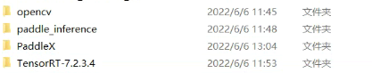              

* 设置OpenCV系统环境变量

用户可根据OpenCV的位置，自行配置系统环境变量

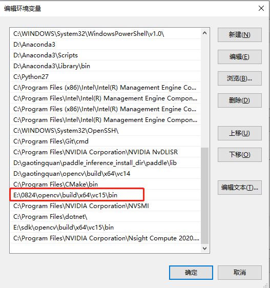              

## 2 代码编译

为了降低开发难度，在本示例中提供了修改好的**预测代码**、**相关头文件**、**CmakeLists文件**,用户自主替换后进行编译即可生成dll

### 2.1 替换相关文件
* **替换model_infer.cpp预测代码**：使用示例中`dlldemo`文件夹中的`model_infer.cpp`和`CMakeLists.txt`文件，替换`PaddleX/deploy/cpp/demo/`目录下的同名文件

* **替换相关头文件**：使用示例中`dllcomon`文件夹中的`logger.h`、`model_infer.h`、`thread_pool.h`、`timer.h`四个头文件放置于`PaddleX/deploy/cpp/model_deploy/common/include/`目录下
### 2.2 使用Cmake进行编译
* 使用Cmake进行编译，我们主要对`PaddleX/deploy/cpp`中代码进行编译，并创建`out`文件夹用来承接编译生成的内容

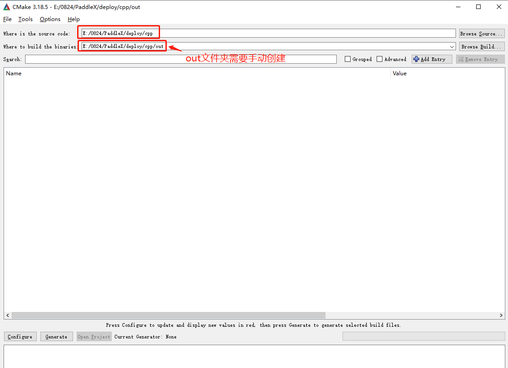              

* 点击Configure进行选项

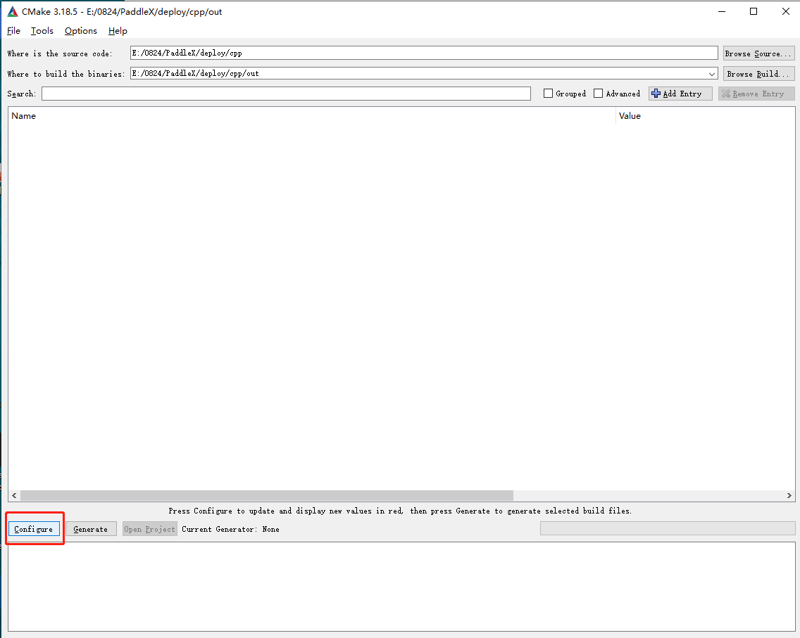              

* 选择X64，并点击finish

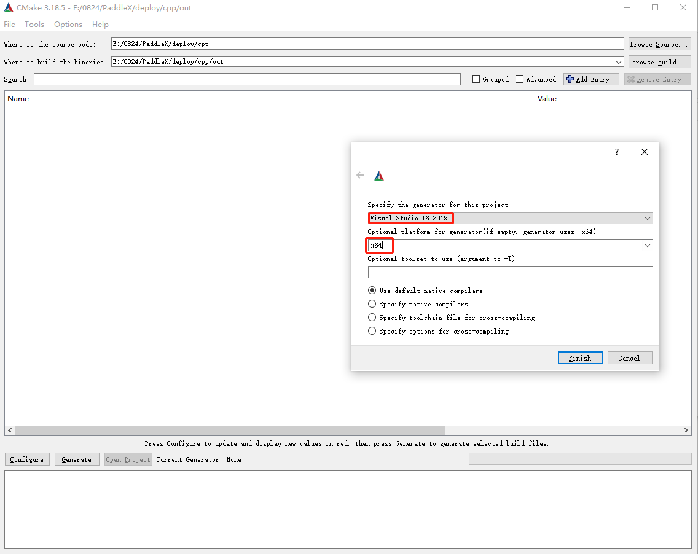              

* 点击Generate进行生成，此时生成失败，

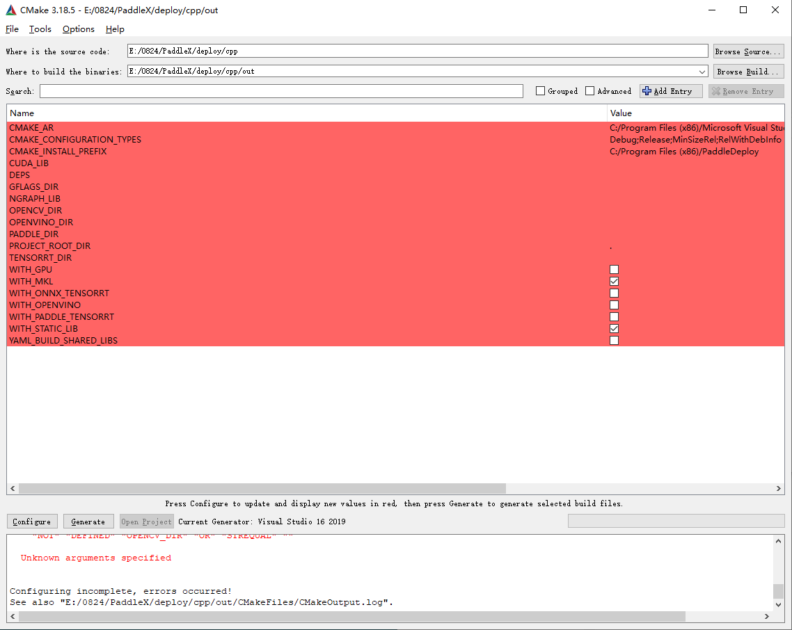              

* 用户在这里补充opencv tensorrt paddle预测库，cuda的lib库的路径，并且勾选WITH_GPU  WITH_MKL WITH_TENSORRT 几项然后重新进行生成

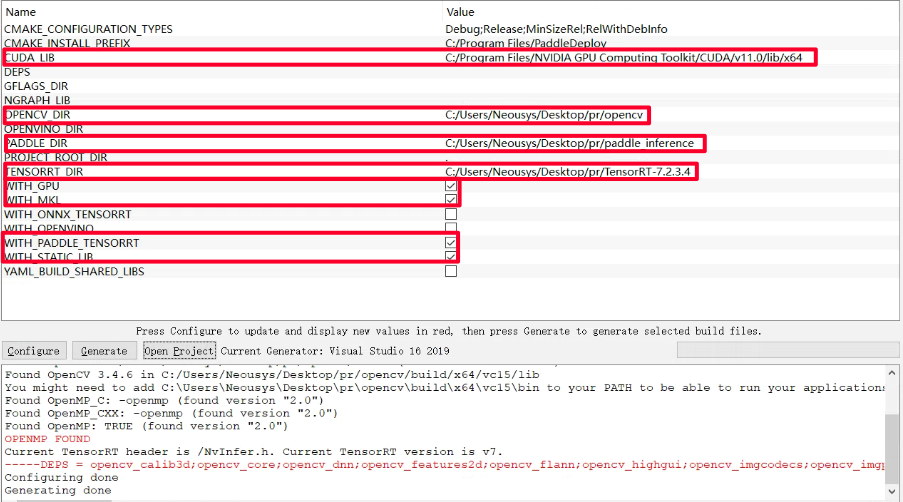              

* 最终在out文件夹中出现了.sln文件，则表示通过cmake生成成功了解决方案

* 打开sln文件，会发现在PaddleDeploy目录下生成了7个项目，其中关键的是

`batch_infer`

`model_infer`

`multi_gpu_model_infer`

 `tensorrt_infer`
* 右键并重新生成对应的dll

             

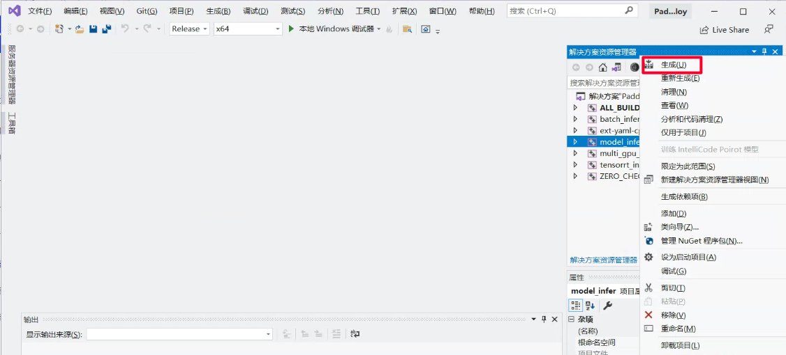             

## 3 创建一个C#项目并调用dll

* 目前已经给出了C#项目，支持PaddleX PaddleClas PaddleDetection PaddleSeg的模型去预测，为了方便大家使用，提供了多线程、一键启动tensoRT等功能。
* 用户只需要下载好C#工程 `csharp`运行.sln文件即可呈现如下文件形式：

* 用户选择Debug X64模式进行调式

* 此外需保证在C#项目的`bin\x64\Debug`下包含以下dll，再进行预测推理

  - `model_infer.dll`, 位于上边cmkae编译的目录下: `PaddleX\deploy\cpp\out\paddle_deploy\Release`
  - 其余dll, 位于以下目录: `PaddleX\deploy\cpp\out\paddle_deploy`
  - `paddle2onnx.dll`、`onnxruntime.dll`，位于`paddle_inference\third_party\install\paddle2onnx` `paddle_inference\third_party\install\onnxruntime`文件中
  - `OpenCvSharp.Extensions.dll` 位于`libs\opencvsharp453\NativeLib\x64`中，移动到`bin`目录下即可

* 如下全部dll所需文件

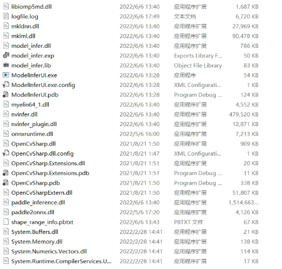             

### 3.4 C#项目:可视化界面功能简要描述

- 1.可加载PaddleSeg, PaddleClas, PaddleDetection以及PaddleX导出的部署模型, 分别对应模型选择中的: seg, clas, det, paddlex
- 2.目前也支持GPU下加载MaskRCNN进行实例分割可视化推理，需选择模型: mask
- 3.点击初始化模型，选择模型文件夹即可 —— 文件夹格式如下
   - inference_model
       - *.yml
       - *.pdmodel
       - *.pdiparams
       - paddlex的模型含有两个yml，其余套件导出只有一个yml/yaml
- 4.支持一键启动TensorRT进行加速
- 5.支持多线程调用。 

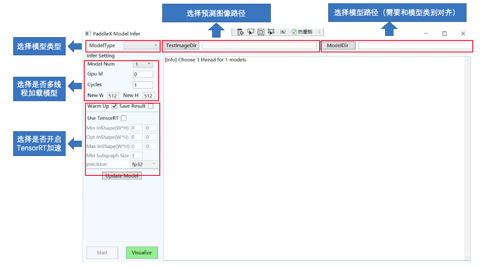             

* 正常加载模型预测

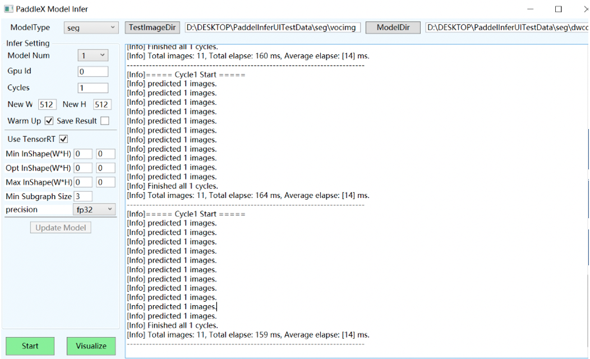             

* 多线程预测

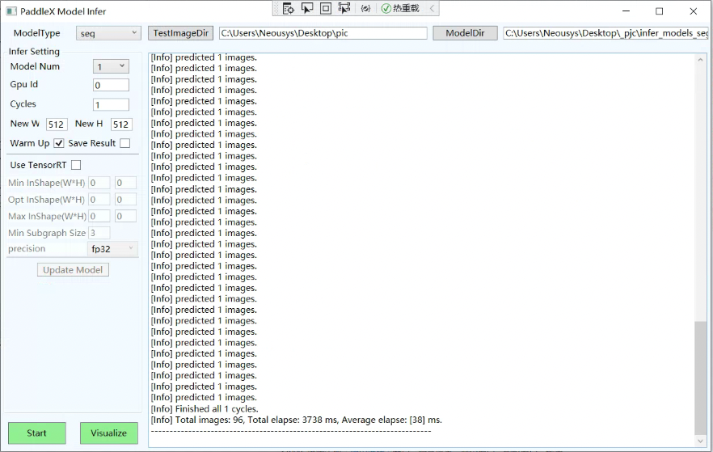             

* 开启TensorRT预测

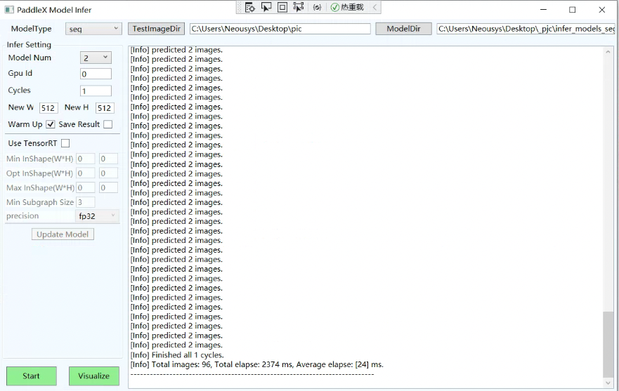             

### 3.6 C#项目模型推理/数据流向简要说明

* 图像识别流程

             

* 目标检测流程

             

* 语义分割流程

             

* 实例分割流程(MaskRCNN)

             

> 该流程在任何模型类型下都是成立的，只是det类型只对应目标检测流程，seg类型只对应语义分割流程， clas类型只对应图像识别流程， mask类型只对应实例分割流程(MaskRCNN)。
> 在paddlex类型下时，底层也是自动转为det、seg、clas类型进行实现的。
